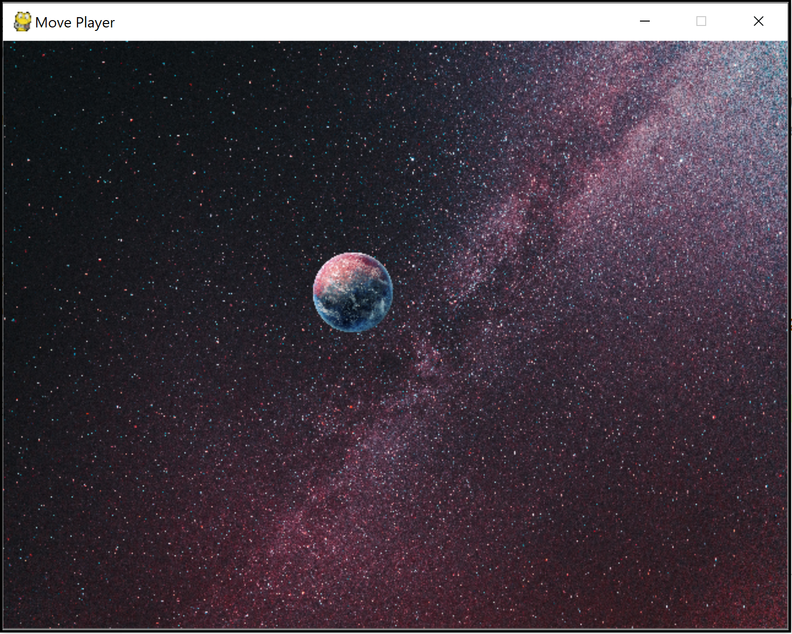
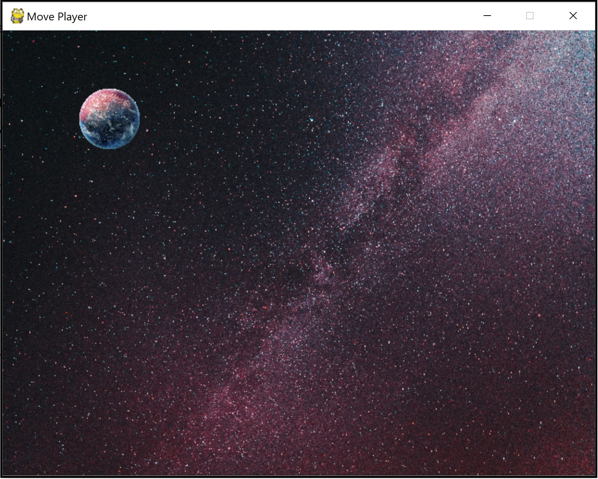
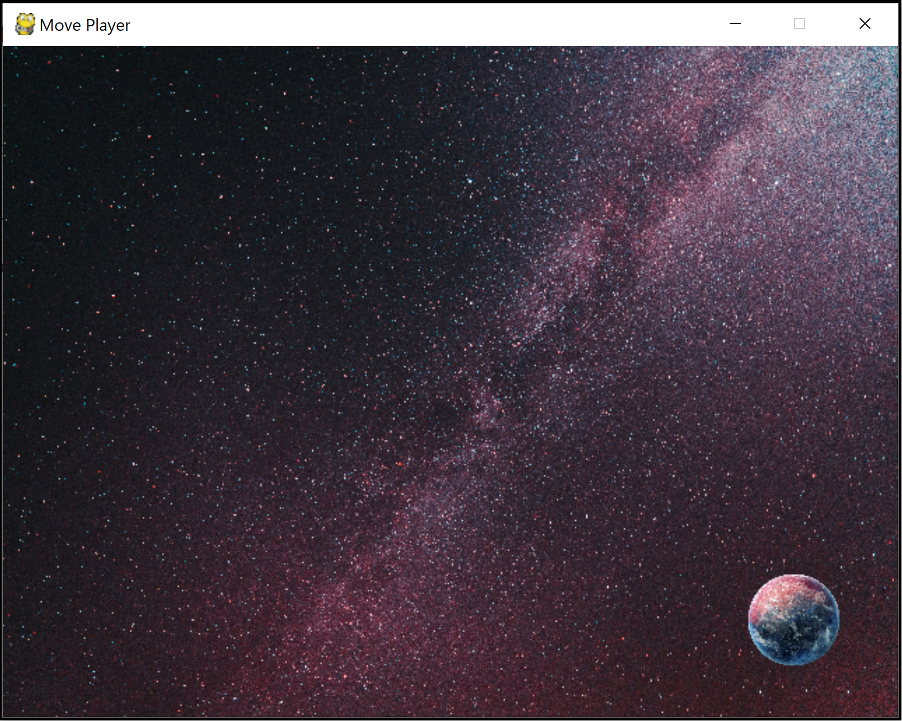

## A05 - CovidZAR.EIEIO
### Mika Morgan
### Description:

This is a Python game similar to agar.io. This first part sets up the game window based on user input passed in as command line arguments. The user can designate the window title, screen size, background image, and sprite image for the player. A GUI window will spawn to the specified size and the specified background image will fill the screen (scaled to fit). A single player will spawn on the middle of the window, using the image passed in. The sample background and player image used in the example commands should display:

The player can be moved using the up, down, left, and right arrow keys on the keyboard. Because this is a 2D game using a top-down perspective, the up and down arrows move the player's y position on the screen, and the left and right arrows move the player's x position on the screen.

Example of player movement using the arrow keys:

### Files

|   #   | File            | Description                                        |
| :---: | --------------- | -------------------------------------------------- |
|   1   | [game.py](game.py)         | Main driver of my project that launches game.      |
|   2   | [bg.jpg](bg.jpg)           | Galaxy image used as possible background (but user can pass in a different file).     |
|   3   | [sprite.png](sprite.png)         | Planet image used as possible player (but user can pass in a different file).      |

### Instructions

- Make sure you install Python on your device. Instructions and download can be found [here](https://www.python.org/downloads/). I used version Python 3.7.2, but there are updated versions available.
  
- The program expects five parameters in the command line when ran:
  - the window title that will display at the top of the game screen
  - the file path for the background image that will fill the screen
  - the file path for the image to be used as the main player
  - the width of the game screen
  - the height of the game screen

- Some things to note:
  - You must enter the paramaters in order, and you must use the = symbol in between the key and value
  - Argument key names must be entered exactly as the examples below
  - Be sure the file path is accessible from where you are calling (might have to include full path name)
  - PNG files work best for players, to preserve the transparent layer around your character

- Example Command:
    - `python <code_name> <bg_image_filepath> <player_image_filepath> <screen_width> <screen_height>`
    - `python game.py title="Move Player" bg_path=bg.jpg img_path=sprite.png width=640 height=480`