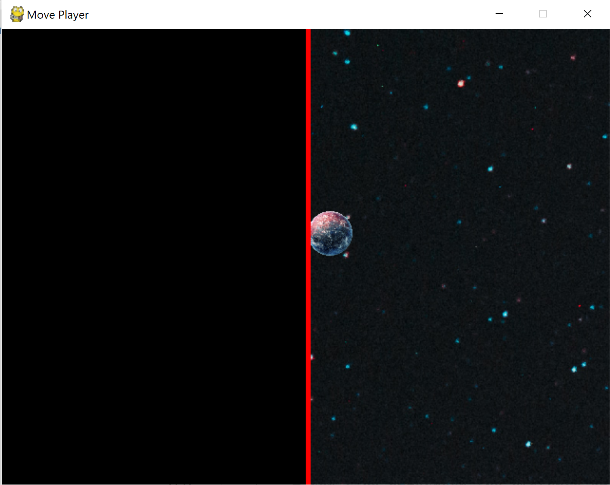

## P01.2 - CovidZAR.EIEIO cont.
### Mika Morgan
### Description:

This is a Python game similar to agar.io. This second part expands on the first program portion, found [here](./../P01.1/README.md). The updated game code does the same as before, except the background image is stretched to 5 times the game window width and 5 times the game window height. As the player moves, the top down view camera moves with them, scrolling around the portion of the image within current view. When the player hits the image border, a red wall indicating the end of the game world appears. The camera is allowed to scroll past the image end to keep the camera centered around the player at all times.

The sample background and player image used in the example commands should display:

The top and left image borders can be seen, with the red border alert. You can also see an empty black background beyond the game image, which allows the camera to remain centered on the player. The previous examples show a 640 x 480 game window, but the game is scalable to any size that fits your device screen. 

Example of game play using a 1040 x 700 screen size:

### Files

|   #   | File            | Description                                        |
| :---: | --------------- | -------------------------------------------------- |
|   1   | [game_pt2.py](game_pt2.py)         | Main driver of my project that launches game.      |
|   2   | [bg.jpg](bg.jpg)           | Galaxy image used as possible background (but user can pass in a different file).     |
|   3   | [sprite.png](sprite.png)         | Planet image used as possible player (but user can pass in a different file).      |
|   4   | [top_border.png](top_border.png)         | Example screenshots of game play.      |
|   5   | [left_border.png](left_border.png)         | Example screenshots of game play.      |
|   6   | [right_border.png](right_border.png)         | Example screenshots of game play.      |
|   7   | [bottom_left_corner.png](bottom_left_corner.png)         | Example screenshots of game play.      |
|   8   | [bg.mp3](bg.mp3)         | Background music: Deep Blue, courtesy of [bensound](https://www.bensound.com)     |

### Instructions

- Make sure you install Python on your device. Instructions and download can be found [here](https://www.python.org/downloads/). I used version Python 3.7.2, but there are updated versions available.
  
- The program expects seven parameters in the command line when ran:
  - the window title that will display at the top of the game screen
  - the file path for the background image that will fill the screen
  - the file path for the image to be used as the main player
  - the width of the game screen
  - the height of the game screen
  - the starting player width
  - the starting player height

- Some things to note:
  - Parameters do not have to be in order, but you must use the = symbol in between the key and value
  - Argument key names must be entered exactly as the examples below
  - Be sure the file path is accessible from where you are calling (might have to include full path name)
  - PNG files work best for players, to preserve the transparent layer around your character

- Example Command:
    - `python <code_name> <window_title> <bg_image_filepath> <player_image_filepath> <screen_width> <screen_height> <player_start_x> <player_start_y>`
    - `python game.py title="Move Player" bg_path=bg.jpg img_path=sprite.png width=640 height=480 player_start_x=70 player_start_y=70`